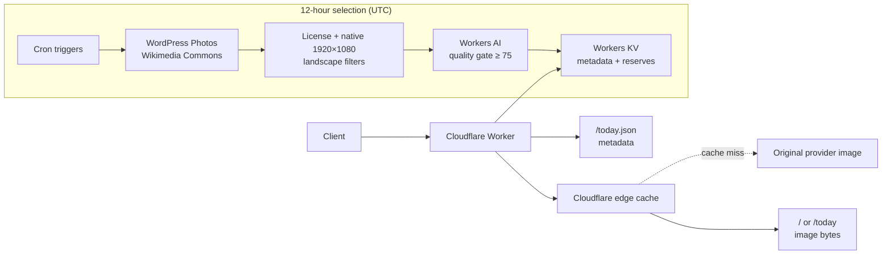

# Cattle Picture of the Day

[](https://github.com/ach968/daily-cattle/actions/workflows/production-health.yml)

This Cloudflare Worker publishes one verified, high-quality, openly licensed photograph of cattle in a pasture for each 12-hour UTC slot. `GET /` and `GET /today` stream the same untouched upstream image bytes; `GET /today.json` provides the slot, selected provider, canonical page, attribution, source URL, license, native dimensions, and selection metadata.

## Architecture



## Provider and selection policy

The WordPress Photo Directory is the primary anonymous provider. Wikimedia Commons is the fallback only when WordPress cannot prepare the next image and fill available reserve slots. Discovery and selection run only in scheduled jobs; ordinary `/` and `/today` requests do not discover images or invoke Workers AI.

No image-provider key, account, card, or secret is required. Provider requests identify this service with a descriptive User-Agent and generate low scheduled daily traffic. Wikimedia Commons uses bounded retry/backoff for transient failures. WordPress classifies transient search failures for the selection and fallback path but does not internally retry searches.

Eligible images must be openly licensed under CC BY, CC BY-SA, CC0, or Public Domain. They must be native landscape images—at least 1920 pixels wide and 1080 pixels high, with width greater than height. The service stores provider metadata only, never image bytes, and streams the original upstream image without resizing, cropping, recompression, transformation, or upscaling.

The quality gate is 75/100. Each preparation run shares a maximum budget of 20 preview submissions to Workers AI across both providers. It prepares the next 12-hour UTC slot and maintains up to nine verified reserve selections as a buffer. State also retains the last 30 served, globally namespaced photo IDs so recently served images do not reenter selection.

## Cloudflare setup and deployment

The checked-in Wrangler configuration already binds the production `STATE` KV namespace (`eb36e91840db454fa0a00d12c098b1d9`) and the remote `AI` binding. Do not create or substitute a new KV namespace for this deployment.

From the project directory, install dependencies, authenticate Wrangler, and run local verification:

```bash
npm install
npx wrangler login
npm test
npm run typecheck
npx wrangler deploy --dry-run
```

The deployed Worker uses the `AI` binding for scheduled quality scoring. An API token is not used for provider discovery or deployed Worker image selection. It is needed only for the optional direct Workers AI REST benchmark below. If Workers AI reports that a model agreement is required, complete the official Cloudflare agreement for the account, then retry the scheduled preparation.

Deploy after the checks pass:

```bash
npm run deploy
```

Record the exact `workers.dev` URL printed by Wrangler. Deployment should list the `STATE` KV binding, `AI` binding, and the two UTC cron triggers.

## Quality benchmark

The fixed benchmark evaluates five known accepted and five known rejected WordPress Photo Directory CC0 previews against the production prompt and threshold. It is optional and calls the Cloudflare Workers AI REST API directly, so provide scoped credentials only in your shell and never commit or print the token:

```bash
export CLOUDFLARE_ACCOUNT_ID="your-account-id"
read -rs CLOUDFLARE_API_TOKEN
export CLOUDFLARE_API_TOKEN
npm run benchmark
```

It prints one result per preview and exits nonzero unless all ten expectations match. If model behavior changes, adjust only the fixed prompt wording; do not change the threshold, expected labels, native-dimension gate, or license policy merely to force a passing benchmark. Product-policy changes to the threshold must remain explicit and test-covered.

## Scheduled bootstrap and smoke check

Preparation runs every 12 hours at `45 11,23 * * *`, and promotion follows 15 minutes later at `0 0,12 * * *`; both schedules use UTC. After deployment, initialize production state through those scheduled handlers:

```bash
npx wrangler dev --remote --test-scheduled
```

In a second terminal, invoke:

```bash
curl "http://localhost:8787/cdn-cgi/handler/scheduled?cron=45+11%2C23+*+*+*&time=1787787900000&format=json"
curl "http://localhost:8787/cdn-cgi/handler/scheduled?cron=0+0%2C12+*+*+*&time=1787788800000&format=json"
```

Both requests should report `"outcome":"ok"`. Stop remote development immediately afterward. Then verify the deployed service:

```bash
export SERVICE_URL="https://the-exact-workers-dev-url-from-wrangler"
npm run smoke
```

The smoke check downloads `/` and `/today`, confirms byte-identical image responses, and verifies the matching `/today.json` UTC slot, provider metadata, canonical attribution links, native dimensions, allowed license, MIME type, ETag, cache, and CORS headers.

## Production health monitoring

Cloudflare remains the scheduler for preparation and promotion. GitHub Actions runs a separate production check every 12 hours at `00:17` and `12:17 UTC`, after the corresponding promotion, and can also be run manually from the repository's Actions tab. The check fails when `/today.json` is unavailable, stale for the current UTC slot, retained from the previous slot, malformed, or below the 75-point quality threshold. A reserve promotion is healthy because it still produces a new verified selection.

Run the same check locally with:

```bash
SERVICE_URL="https://daily-cattle.andrewkkchen.workers.dev" npm run health
```

Cron-trigger changes can take up to 15 minutes to propagate. Workers KV is eventually consistent, so a request around `00:00` or `12:00 UTC` can briefly return the previous slot's verified selection. The service retains the verified quality and licensing gates and uses its reserve buffer rather than performing discovery during image requests.

## Attribution and local development

Use `/today.json` as the attribution record: it supplies the UTC slot, provider, provider-scoped photo ID, canonical provider page, creator information when available, source URL, and license URL. Preserve those links and the selected license when republishing an image.

For local development:

```bash
npm run dev
```

Local live AI requires Cloudflare authentication and consumes the account's Workers AI allocation.
